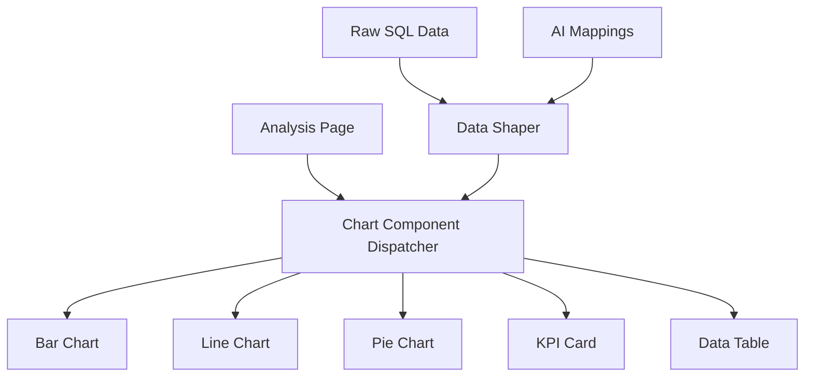
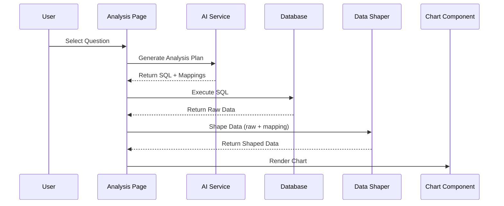

# Agnostic Charting System Design

## Overview

The Agnostic Charting System is designed to dynamically visualize SQL query results in multiple chart formats without tightly coupling the data source to the visualization components. This document outlines the architecture, data flow, and implementation details of the system.

## Core Design Principles

1. **Data Agnosticism**

   - Chart components are independent of the data source
   - Data transformation happens through a well-defined contract
   - Components only know about their specific data shape

2. **Type Safety**

   - Strong TypeScript contracts throughout the system
   - Runtime type validation for data integrity
   - Clear error boundaries and fallbacks

3. **Extensibility**
   - Easy to add new chart types
   - Pluggable data transformation layer
   - Configurable styling and options

## System Architecture

### 1. Component Layer Structure



### 2. Data Flow



## Core Components

### 1. Data Contracts (`lib/chart-contracts.ts`)

The foundation of type safety and data shape definition.

```typescript
// Base data point interface
interface BaseChartDataPoint {
  id?: string | number;
}

// Example contract for bar charts
interface BarChartDataPoint extends BaseChartDataPoint {
  category: string;
  value: number;
  label?: string;
  color?: string;
}

// Chart type definition
type ChartType = "bar" | "line" | "pie" | "kpi" | "table";
```

### 2. Data Shaper (`lib/data-shaper.ts`)

Transforms raw SQL data into chart-specific formats.

```typescript
interface ChartDataMapping {
  chartType: ChartType;
  mapping: {
    [key: string]: string; // Maps SQL columns to chart properties
  };
  options?: {
    sortBy?: string;
    sortDirection?: "asc" | "desc";
    limit?: number;
  };
}

function shapeDataForChart(
  rawData: any[],
  mapping: ChartDataMapping,
  chartType: ChartType
): ChartData;
```

### 3. Chart Components (`components/charts/`)

Individual "dumb" components that render specific chart types.

```typescript
interface ChartComponentProps {
  chartType: ChartType;
  data: ChartDataType;
  title?: string;
  className?: string;
}
```

## Implementation Details

### 1. Chart Type Support

| Chart Type | Use Case             | Data Contract          | Example Mapping                                    |
| ---------- | -------------------- | ---------------------- | -------------------------------------------------- |
| Bar Chart  | Category comparisons | `BarChartDataPoint[]`  | `{ category: 'etiology', value: 'count' }`         |
| Line Chart | Time series, trends  | `LineChartDataPoint[]` | `{ x: 'date', y: 'measurement' }`                  |
| Pie Chart  | Part-to-whole        | `PieChartDataPoint[]`  | `{ label: 'category', value: 'percentage' }`       |
| KPI Card   | Single metrics       | `KpiData`              | `{ value: 'current', trend: { value: 'change' } }` |
| Table      | Raw data display     | `TableData`            | Column definitions                                 |

### 2. Data Transformation Process

1. **Input Validation**

   - Verify raw data structure
   - Validate mapping configuration
   - Check chart type compatibility

2. **Data Processing**

   - Apply sorting (if specified)
   - Apply limits (if specified)
   - Handle data type conversions
   - Calculate derived values (e.g., percentages)

3. **Output Validation**
   - Ensure transformed data matches contract
   - Provide meaningful error messages
   - Handle edge cases (empty data, null values)

### 3. Error Handling

1. **Type Guards**

   ```typescript
   function isBarChartData(data: any): data is BarChartDataPoint[] {
     return (
       Array.isArray(data) &&
       data.length > 0 &&
       "category" in data[0] &&
       "value" in data[0]
     );
   }
   ```

2. **Error Boundaries**

   - Component-level error catching
   - Fallback UI components
   - Error logging and reporting

3. **Data Validation**
   - Input data validation
   - Mapping validation
   - Output data validation

## Integration with AI System

### 1. AI Analysis Plan

The AI service provides:

- SQL query for data retrieval
- Recommended chart type
- Available mappings for different chart types
- Explanation of the analysis

### 2. Mapping Structure

```typescript
interface AvailableMappings {
  recommendedChartType: ChartType;
  mappings: {
    [K in ChartType]?: ChartDataMapping;
  };
}
```

## Usage Example

```typescript
// 1. Get analysis plan from AI
const plan = await generateAnalysisPlan(question);

// 2. Execute SQL query
const rawData = await executeQuery(plan.generatedSql);

// 3. Shape data for visualization
const shapedData = shapeDataForChart(
  rawData,
  plan.availableMappings[plan.recommendedChartType],
  plan.recommendedChartType
);

// 4. Render chart
<ChartComponent
  chartType={plan.recommendedChartType}
  data={shapedData}
  title={question}
/>;
```

## Production Considerations

### 1. Performance

- Implement data caching
- Optimize large dataset handling
- Consider server-side data shaping
- Implement virtualization for large datasets

### 2. Scalability

- Support for more chart types
- Custom chart configurations
- Theme customization
- Export capabilities

### 3. Maintainability

- Comprehensive unit tests
- Integration tests
- Documentation
- Type safety
- Error handling

### 4. Security

- Input validation
- SQL injection prevention
- Data access controls
- Error message sanitization

## Future Enhancements

1. **Additional Chart Types**

   - Scatter plots
   - Heat maps
   - Radar charts
   - Combination charts

2. **Advanced Features**

   - Chart animations
   - Interactive tooltips
   - Drill-down capabilities
   - Custom color schemes

3. **Data Processing**

   - Advanced aggregations
   - Custom calculations
   - Data filtering
   - Real-time updates

4. **Export Options**
   - PNG/SVG export
   - PDF reports
   - Raw data export
   - Sharing capabilities
