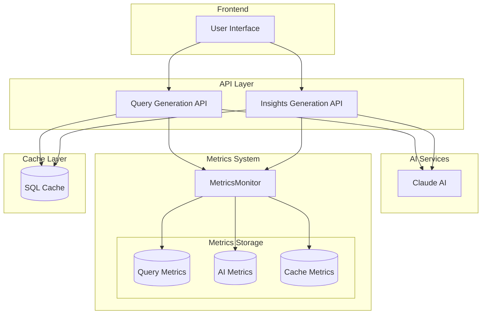
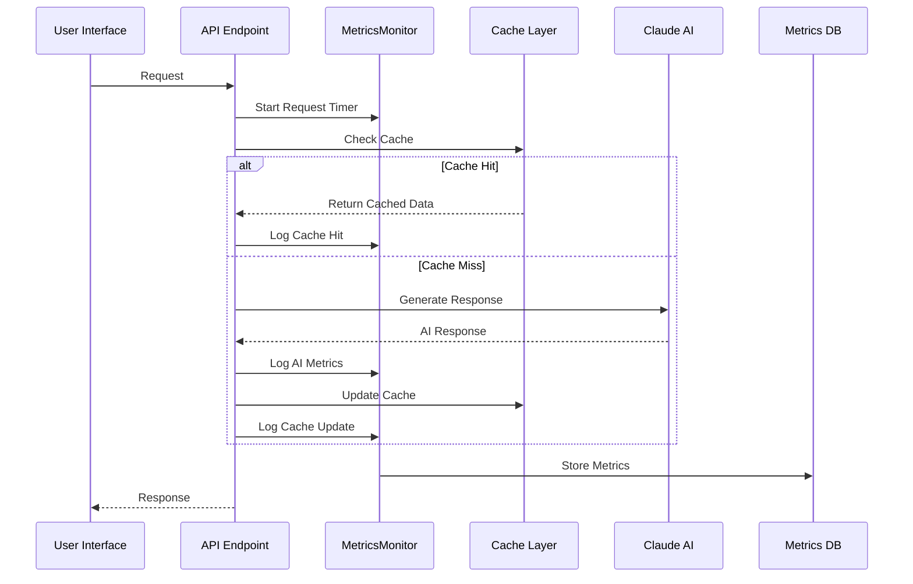
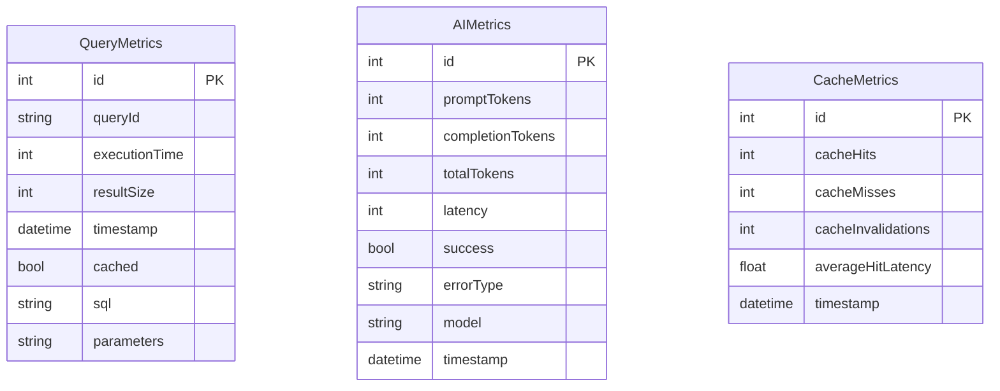
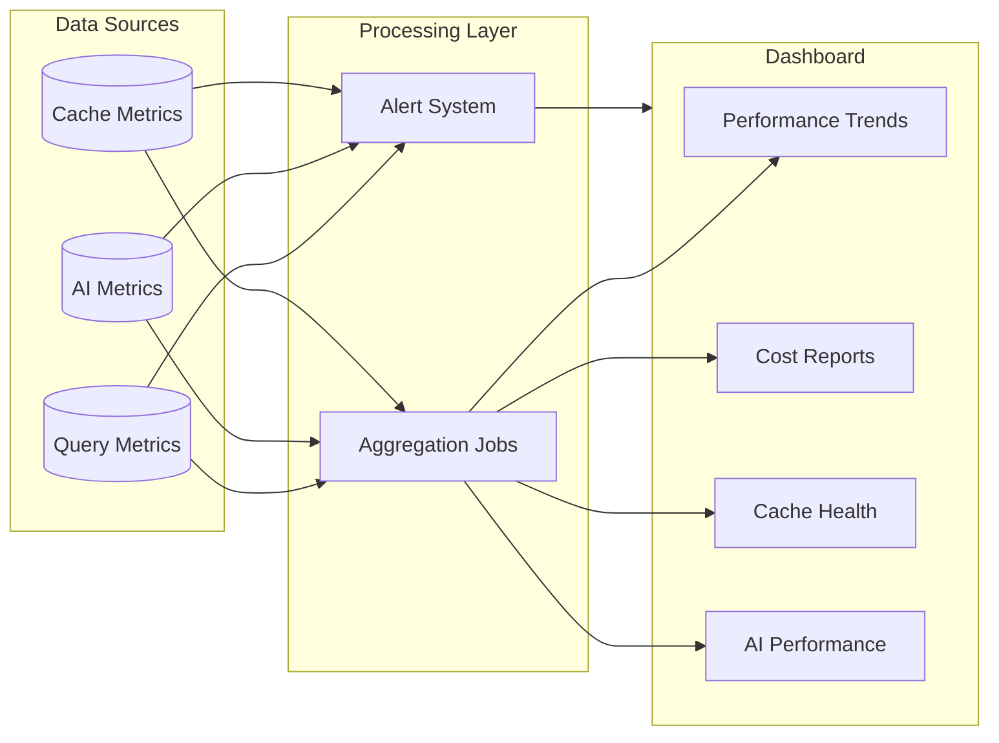

# AI Metrics Improvement Initiative

## Motivation

The InsightGen POC relies heavily on AI-powered features for generating SQL queries and analytical insights. As we move towards production, we need to:

1. **Understand System Performance**

   - Monitor AI response times and quality
   - Track cache effectiveness
   - Identify performance bottlenecks
   - Measure system reliability

2. **Optimize Costs**

   - Monitor AI token usage
   - Evaluate cache hit rates
   - Identify opportunities for prompt optimization
   - Track resource utilization

3. **Improve User Experience**
   - Measure end-to-end response times
   - Track success/failure rates
   - Monitor cache performance
   - Identify areas for improvement

## Architecture

### System Overview



### Metrics Flow



### Data Model



### Monitoring Dashboard Architecture



## Implementation

### 1. Metrics Infrastructure

#### Database Tables

```sql
-- Query Performance
rpt.QueryMetrics (
    queryId, executionTime, resultSize,
    timestamp, cached, sql, parameters
)

-- AI Performance
rpt.AIMetrics (
    promptTokens, completionTokens, totalTokens,
    latency, success, errorType, model, timestamp
)

-- Cache Performance
rpt.CacheMetrics (
    cacheHits, cacheMisses, cacheInvalidations,
    averageHitLatency, timestamp
)
```

#### Monitoring Utility

- Singleton `MetricsMonitor` class
- Type-safe metric interfaces
- Automatic connection pool management
- Error-resilient logging
- Performance report generation

### 2. Metrics Collection Points

#### AI Operations

- Request latency
- Token usage (when available)
- Success/failure rates
- Error types
- Model identification
- Response validation results

#### Cache Operations

- Hit/miss rates
- Invalidation events
- Access latency
- Cache update performance
- Cache validation results

#### Database Operations

- Query execution time
- Result sizes
- Parameter tracking
- Cache status
- SQL statement logging

### 3. Current Coverage

The metrics system has been implemented in two key AI endpoints:

1. **Query Generation** (`/api/ai/generate-query`)

   - SQL query generation metrics
   - Analysis plan validation
   - Cache performance for questions
   - AI response quality

2. **Insights Generation** (`/api/assessment-forms/[id]/insights`)
   - Form analysis metrics
   - Insights generation performance
   - Cache effectiveness
   - AI response validation

## Benefits

1. **Performance Optimization**

   - Identify slow queries
   - Optimize cache strategies
   - Improve AI prompt efficiency
   - Reduce response times

2. **Cost Management**

   - Monitor AI API usage
   - Optimize cache utilization
   - Track resource consumption
   - Identify cost-saving opportunities

3. **Quality Assurance**

   - Track error rates
   - Monitor response quality
   - Validate cache integrity
   - Ensure system reliability

4. **Development Insights**
   - Data-driven improvements
   - Performance trending
   - Issue identification
   - System health monitoring

## Future Improvements

### 1. Monitoring Dashboard

- Real-time metrics visualization
- Performance trends
- Error rate tracking
- Cache effectiveness charts
- Cost analysis

### 2. Alert System

- Performance thresholds
- Error rate alerts
- Cache invalidation notifications
- Cost warnings

### 3. Advanced Analytics

- AI response quality scoring
- Prompt optimization suggestions
- Cache strategy recommendations
- Performance prediction

### 4. Enhanced Caching

- Smart cache warming
- Partial cache invalidation
- Cache compression
- Version-aware caching

### 5. A/B Testing Framework

- Prompt variation testing
- Cache strategy comparison
- Performance optimization experiments
- User impact analysis

## Getting Started

To view current metrics:

```sql
-- Query Performance Overview
SELECT AVG(executionTime) as avgTime,
       MAX(executionTime) as maxTime,
       COUNT(*) as totalQueries
FROM rpt.QueryMetrics
WHERE timestamp >= DATEADD(day, -7, GETUTCDATE());

-- AI Success Rate
SELECT model,
       COUNT(*) as totalCalls,
       AVG(CASE WHEN success = 1 THEN 100.0 ELSE 0 END) as successRate
FROM rpt.AIMetrics
GROUP BY model;

-- Cache Effectiveness
SELECT SUM(cacheHits) as totalHits,
       SUM(cacheMisses) as totalMisses,
       AVG(averageHitLatency) as avgLatency
FROM rpt.CacheMetrics;
```

## Next Steps

1. Implement the monitoring dashboard
2. Set up the alert system
3. Deploy advanced analytics
4. Enhance caching strategies
5. Establish A/B testing framework

## Contributing

When adding new features that use AI or caching:

1. Include appropriate metric collection
2. Add performance monitoring
3. Implement cache metrics
4. Document metric points
5. Update dashboard (when available)
