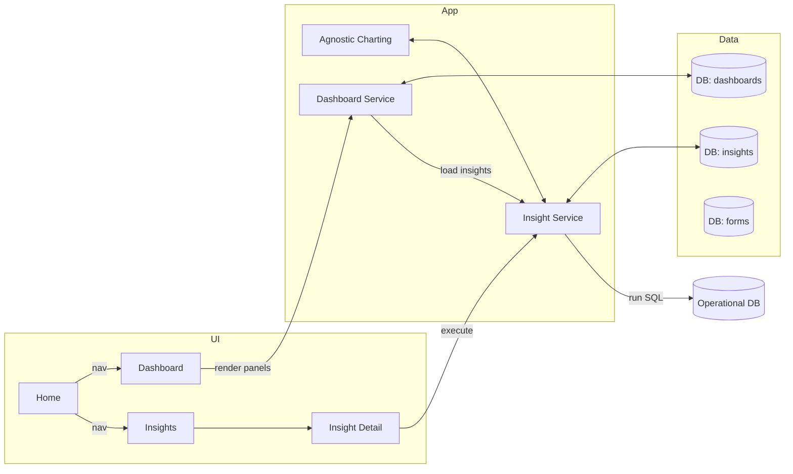

# Chart Insight Saving and Dashboard Design

## Overview

This document elaborates the final major feature of the POC: persist and display meaningful insights as charts. It introduces saved insights, a schema-agnostic question flow (with or without a selected form), and a new navigation with Home, Dashboard, and Insights pages. It builds on the existing Agnostic Charting design and Export design while clearly separating “export” (file-based) from “save” (database-backed, live queryable).

## Goals

- Persist insights (question + SQL + chart config) for reuse and dashboarding.
- Support both form-specific and schema-wide (non-form) questions/workflows.
- Provide a new UX shell (left nav) and three pages: Home, Dashboard, Insights.
- Execute saved insights on demand to render charts using the agnostic charting pipeline.
- Keep reuse high: leverage existing prompts, mapping, and charting contracts.

## Non-Goals (for MVP)

- Cross-tenant permissions, versioned insights, or complex RBAC.
- Advanced scheduling, alerting, or real-time streaming widgets.
- Complex cross-panel dashboard filters and drill-through interactions.

## Terminology

- Insight: A saved analytical unit containing the question, its SQL, and chart configuration required to render a chart (and optional explanation/metadata).
- Form-Specific Insight: An insight generated with a given form definition in context.
- Schema-Wide Insight: An insight generated without a form definition; queries target the base schema.
- Dashboard: A configurable grid layout where panels reference saved insights.
- Panel: A grid cell that binds to a single saved insight.

## High-Level Architecture



## Data Model

MVP keeps the data model minimal and JSON-friendly to align with Agnostic Charting.

### Table: insights

- id: string (uuid)
- name: string (human-readable title)
- question: string (natural language)
- scope: enum("form", "schema")
- formId: string | null (nullable for schema-wide)
- sql: text (final executable SQL)
- chartType: string (e.g., "bar" | "line" | "pie" | "kpi" | "table")
- chartMapping: json (ChartDataMapping from agnostic design)
- chartOptions: json (visual options like sort/limit/colors)
- description: text | null (optional human notes / AI explanation)
- tags: json | null (array of strings)
- createdBy: string | null
- createdAt: datetime
- updatedAt: datetime
- isActive: boolean (default true)

Notes:
- chartMapping and chartOptions reuse contracts defined in docs/design/agnostic-charting-design.md.
- We do not store query results; insights execute live.

### Table: dashboards

- id: string (uuid)
- name: string
- layout: json (grid settings; e.g., rows, columns, gap)
- panels: json (array of panel configs; each panel references an `insightId`)
- createdBy: string | null
- createdAt: datetime
- updatedAt: datetime

Example `panels` JSON:

```json
{
  "rows": 3,
  "cols": 3,
  "gap": 16,
  "panels": [
    { "id": "p1", "r": 1, "c": 1, "rowspan": 1, "colspan": 1, "insightId": null },
    { "id": "p2", "r": 1, "c": 2, "rowspan": 1, "colspan": 1, "insightId": "<insight-uuid>" }
  ]
}
```

## API Design (MVP)

### Insights

- GET `/api/insights` → list with filters (scope, formId, tag, search)
- POST `/api/insights` → create
- GET `/api/insights/:id` → detail
- PUT `/api/insights/:id` → update
- DELETE `/api/insights/:id` → soft delete (set `isActive=false`)
- POST `/api/insights/:id/execute` → run SQL, return rows + shaped chart data

`/execute` response:

```json
{
  "rows": [ { "date": "2025-08-01", "count": 12 } ],
  "chart": {
    "chartType": "line",
    "data": [ { "x": "2025-08-01", "y": 12 } ]
  }
}
```

Shaping follows `shapeDataForChart(raw, chartMapping, chartType)`.

### Dashboards

- GET `/api/dashboards/default` → get default dashboard (single for MVP)
- PUT `/api/dashboards/default` → update layout/panels
- POST `/api/dashboards/panel/:panelId/bind` → bind an `insightId` to a panel

### Home Stats

- GET `/api/stats/overview` → `{ formsActive: number, insightsTotal: number }`

## Workflows

### A. Save Insight (from current funnel)

1) User completes a sub-question in the funnel.
2) Click “Save Insight”.
3) Modal: pre-populate question, sql, recommended chartType + mapping from AI output.
4) User edits name, tags, description; confirm.
5) Insight created. Offer “Add to Dashboard”.

Reuse: existing prompts output mapping/chart type per agnostic design; we persist these.

### B. Create Schema-Wide Insight (no form)

1) User navigates to Insights → “New Insight”.
2) Choose “Database (no form)”.
3) Launch the same funnel workflow but omit `formDefinition` in prompts; provide `schemaDescription` priming instead (already supported by prompt variants).
4) On SQL/chart generation, allow Save Insight (same as A).

### C. Add to Dashboard

1) Dashboard 3×3 grid shows blank panels with a “+”.
2) Click “+” opens insight picker (search, filter by scope/form, tags).
3) Select an insight; panel renders chart by calling `/execute`.
4) Layout and bindings are saved to dashboard config.

### D. Insight Execution (everywhere)

1) UI calls `/api/insights/:id/execute`.
2) Backend executes SQL against the operational DB.
3) Shape data via `shapeDataForChart` using the saved `chartMapping` and `chartType`.
4) Return both raw rows and shaped chart data.

## UI/UX

### Navigation Shell

- Left Nav: Home, Dashboard, Insights
- Main content switches by selection

### Home

- Stats cards: “Active Forms”, “Saved Insights”.
- Future: recently viewed insights, dashboard quick links.

ASCII mockup:

```
┌────────────────────────────┬─────────────────────────────────────────┐
│ Home | Dashboard | Insights│  Home                                   │
├────────────────────────────┼─────────────────────────────────────────┤
│                            │  [Active Forms]   [Saved Insights]     │
│                            │      12                 34              │
│                            │                                         │
└────────────────────────────┴─────────────────────────────────────────┘
```

### Dashboard (3×3 grid MVP)

- Each panel: title (from bound insight), chart surface, overflow menu.
- Empty panel shows “+” to select an insight.
- Controls: Edit layout (optional MVP), Refresh all.

```
┌──────────────── Dashboard ────────────────┐
│┌───┬───┬───┐                              │
││ + │ + │ + │   Click + → Insight Picker   │
│├───┼───┼───┤                              │
││ + │ [Insight A Chart] │ + │              │
│├───┼───┼───┤                              │
││ + │ + │ [Insight B Chart] │              │
│└───┴───┴───┘                              │
└───────────────────────────────────────────┘
```

Insight Picker:
- Search by name/question
- Filter: scope = form/schema; formId; tags
- Preview: question, chartType badge

### Insights

- List: name, scope, form, tags, updatedAt
- Actions: View, Execute, Add to Dashboard, Edit, Delete

Detail View:
- Header: name, scope, form (if any), tags
- Question text
- SQL editor/view (read-only by default; toggle to edit if allowed)
- Execute button → shows result table + chart (agnostic chart component)
- Save changes; “Add to Dashboard” shortcut

Create New Insight:
- Choice: “Form-specific” or “Database (no form)”
- Form-specific → current form selection and the existing funnel flow
- Database (no form) → launches funnel without formDefinition; schema prompt only

## Integration with Agnostic Charting

- chartType and chartMapping are stored per insight at creation time (editable later).
- Execution endpoint retrieves raw rows, then shapes data:
  - `shapeDataForChart(rows, chartMapping, chartType)`
  - Return shaped data to a single Chart component dispatcher.
- This preserves component/data decoupling and enables future chart swaps.

## Reuse of Existing Prompts and Code

- Form-specific path: keep current funnel prompts (include form definition).
- Schema-wide path: reuse existing schema-only prompts (no formDefinition) already present in the codebase.
- Both paths produce SQL + recommended chartType + mapping options; we persist the chosen mapping.

## MVP Validation and Performance

- SQL execution timeouts; safe limits and pagination for tables.
- Optional caching (per insight) with TTL for dashboard loads.
- Graceful error states in panels; show error with retry.

## Home Stats Definition (MVP)

- Active Forms: count from `forms` table or endpoint.
- Saved Insights: count of `insights` where `isActive=true`.

## Security & Governance (MVP)

- Read-only DB credentials for insight execution.
- Input validation and SQL safety (SQL is generated by AI but must pass validation).
- Basic audit fields (createdBy/At, updatedAt).
- No PII in persisted content (SQL/metadata only; no results persisted).

## Migration Plan

1) Create `insights` and `dashboards` tables.
2) Seed a default dashboard with 3×3 layout, all panels empty.
3) Add API routes and client hooks.
4) Integrate “Save Insight” in funnel UI; wire to Insights and Dashboard.

## Implementation Phases

Phase 1 (MVP):
- Data model + CRUD for insights
- `/execute` endpoint with agnostic shaping
- Dashboard 3×3 with insight binding
- Home stats cards
- Insights list and detail with Execute

Phase 2:
- Edit layout, resize panels, refresh intervals
- Tags and filters improvements; quick add to dashboard from detail
- Basic caching

Phase 3:
- Shareable dashboards, roles/permissions
- Cross-panel filters and drill-down
- Schedules/alerts, export from dashboard

## Open Questions

- Do we need multi-dashboard support in MVP or is a single default sufficient?
- Should insights be versioned when SQL/chart changes, or simple overwrite is OK initially?
- Global filters (date range, forms) on dashboard: MVP or later?
- Do we require soft-delete only, or hard-delete as admin action?

