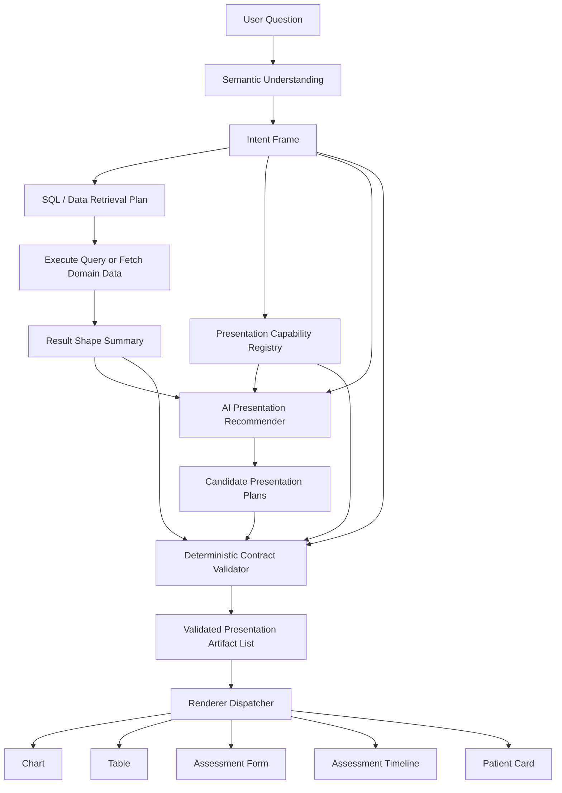
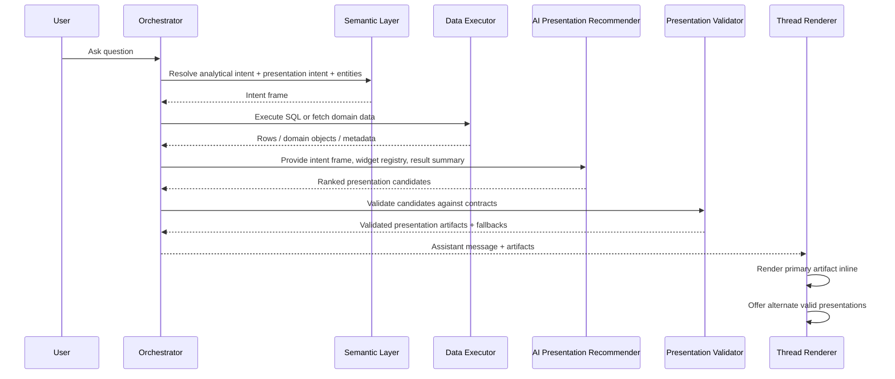
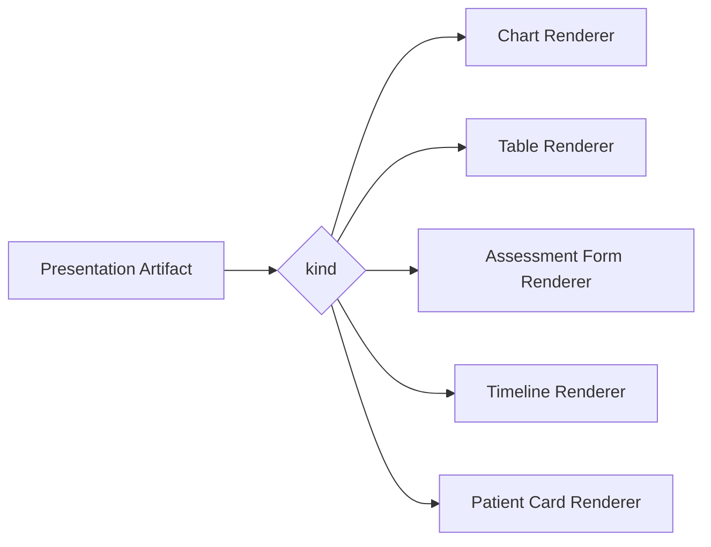
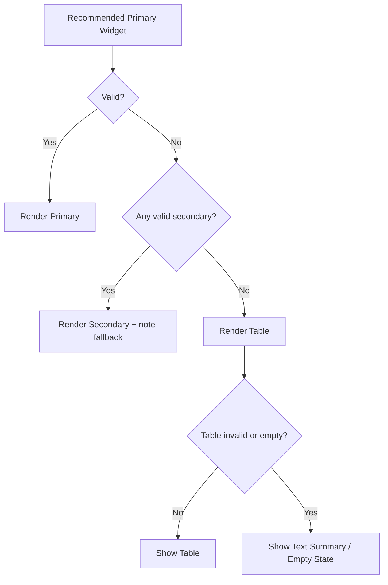

# AI-First Presentation Architecture

**Status:** Design proposal only  
**Scope:** Inline charting fix direction plus future UI widgets  
**Audience:** Product, frontend, backend, semantic-layer, AI orchestration

## 1. Executive Summary

The current inline chart flow is too narrow. It assumes the presentation layer only needs `chart`, `table`, and text-like output, and it mixes three concerns into one heuristic step:

1. Understand the analytical question
2. Decide what UI presentation is appropriate
3. Map result data into a renderable contract

That design is already fragile for charts and will not scale to richer UI outputs such as:

- assessment form
- assessment timeline
- patient medical details card
- future domain widgets

The proposed direction is to replace the current chart-specific artifact planning with a general **Presentation Planning** layer.

The new rule is:

- AI suggests presentation candidates from a registry of supported widgets and their contracts
- the system validates those suggestions against actual resolved entities, actual result shape, and widget contract requirements
- the renderer only receives validated presentation artifacts

This keeps the system AI-first without making the renderer or planner trust free-form AI output.

## 2. Problem Statement

### Current problems

1. Presentation selection is partly heuristic and partly route-dependent.
2. The chart contract is not validated before render.
3. Chart logic is not easily extensible to non-chart widgets.
4. The system does not have a consistent way to distinguish:
   - user explicitly asked for a presentation
   - AI inferred a better presentation
   - system fell back because the preferred presentation was not valid
5. The current artifact model is too generic for safe rendering and too narrow for future widgets.

### Why this matters

If the system is going to support chart, table, patient card, assessment form, timeline, and future widgets, we need one consistent answer to:

`Given the user’s question, resolved entities, query plan, and actual results, what should we render first, and what other presentations should we offer?`

## 3. Design Goals

1. **AI-first suggestions**
   - AI should recommend presentation options.
   - The system should not depend on hard-coded chart heuristics as the primary selector.

2. **Strict rendering contracts**
   - Every widget must declare a typed input contract.
   - The renderer must never receive an unvalidated artifact.

3. **Extensible widget model**
   - Adding `patient_card` or `assessment_timeline` should not require redesigning the planning pipeline.

4. **Consistent intent resolution**
   - Handle explicit requests like "show me a chart".
   - Handle inferred suggestions like "show me wound area for patient x in last 6 months".
   - Handle entity-view requests like "show me patient medical details".

5. **Deterministic fallback**
   - If AI suggestions are invalid or unsupported, fall back cleanly to table/text.

6. **Route parity**
   - New question, follow-up, cached replay, and future workflows should all use the same presentation planner.

## 4. Non-Goals

1. Building every future widget now
2. Replacing the semantic SQL pipeline
3. Defining final UI styling for every widget
4. Solving streaming or live widget interactions in this phase

## 5. Core Design Principles

### 5.1 AI suggests, contracts decide

AI can recommend:

- recommended widget
- alternative widgets
- mapping hints
- user-facing titles and reasoning

AI cannot bypass:

- supported widget registry
- required widget inputs
- result-shape validation
- entity availability checks

### 5.2 Separate analytical intent from presentation intent

The system should stop treating presentation as a side effect of SQL results. Presentation intent is its own structured object.

### 5.3 Explicit request beats inferred preference

If the user explicitly asks for a chart, form, or timeline, that request should be represented directly in the intent frame and treated as a high-priority constraint.

### 5.4 Supported widgets are a product capability, not an AI hallucination

The AI only chooses from registered widgets the product actually supports. This is the right limitation. The system is not “less AI-first” because it has a widget registry; it is simply bounded by real UI capabilities.

### 5.5 One planning pipeline for all results

All entry points should flow through the same presentation planner:

- `/api/insights/ask`
- conversation follow-up
- cached replay
- future saved insight execution

## 6. Proposed Architecture



## 7. End-to-End Workflow



## 8. The Key New Concept: Presentation Intent Frame

The current system has `presentationIntent` and `preferredVisualization`, but that is not enough. The future system needs a richer frame.

### Proposed shape

```ts
type PresentationMode =
  | "chart"
  | "table"
  | "kpi"
  | "assessment_form"
  | "assessment_timeline"
  | "patient_card"
  | "text";

interface PresentationIntentFrame {
  explicitRequest: {
    mode: PresentationMode | null;
    confidence: number;
    source: "user_phrase" | "none";
    phrase?: string;
  };
  inferredNeeds: Array<{
    mode: PresentationMode;
    confidence: number;
    reason: string;
  }>;
  userGoal: "inspect_entity" | "compare" | "trend" | "detail_lookup" | "overview";
  interactionStyle: "single_best" | "show_alternatives";
  entityFocus: {
    patient: boolean;
    assessment: boolean;
    wound: boolean;
  };
}
```

### Why this matters

This separates:

- what the user explicitly asked for
- what AI thinks is a better visualization
- what domain object the user is trying to inspect

That distinction is the missing piece in the current design.

## 9. Widget Capability Registry

The system should maintain a registry of supported presentation widgets. This registry is provided to AI and also used by deterministic validation.

### Proposed shape

```ts
interface PresentationCapability {
  kind: PresentationMode;
  purpose: string;
  bestFor: string[];
  requiredInputs: string[];
  optionalInputs: string[];
  resultRequirements: {
    minRows?: number;
    maxRows?: number;
    requiresNumericField?: boolean;
    requiresTemporalField?: boolean;
    requiresResolvedPatient?: boolean;
    requiresAssessmentId?: boolean;
  };
  mappingContract?: Record<string, "number" | "string" | "date" | "entity_ref">;
}
```

### Example capabilities

| Widget | Purpose | Required Inputs | Typical Trigger |
|---|---|---|---|
| `chart` | comparison or trend | rows + validated mapping | explicit chart request, inferred trend/comparison |
| `table` | exact data inspection | rows + columns | fallback, list request |
| `assessment_form` | inspect one assessment | assessment id or form payload | “show this assessment” |
| `assessment_timeline` | inspect assessment history | patient id + ordered assessment list | “assessment timeline”, “history over time” |
| `patient_card` | inspect patient details | resolved patient + patient detail payload | “show patient medical details” |

### AI prompt input

The AI recommender should see:

- widget names
- widget purposes
- required inputs
- when each widget is a good fit
- which widgets are impossible without certain resolved entities

This keeps the model grounded in real capabilities.

## 10. Presentation Planning Stages

### Stage 1: Intent understanding

The semantic layer should produce:

- analytical intent
- resolved entities
- presentation intent frame

Example:

`show me wound area for patient x in last 6 months`

Could resolve to:

- analytical goal: time-series measurement
- resolved patient: yes
- explicit presentation request: none
- inferred presentations:
  - `chart` confidence 0.88
  - `table` confidence 0.55

### Stage 2: Data retrieval

Two data paths should be supported:

1. **SQL result path**
   - rows and columns from the current analytics pipeline

2. **Domain object path**
   - structured domain payloads for things like patient card or assessment form

This is important because not every widget should be forced through a flat SQL table.

### Stage 3: AI presentation recommendation

The recommender receives:

- user question
- presentation intent frame
- resolved entities
- result shape summary
- supported widget registry

It returns ranked candidates, for example:

```ts
[
  {
    kind: "chart",
    confidence: 0.91,
    reason: "Temporal wound area values are best understood as a trend",
    mappingHint: { x: "assessmentDate", y: "woundArea" },
    priority: "primary"
  },
  {
    kind: "table",
    confidence: 0.63,
    reason: "User may still want exact values",
    priority: "secondary"
  }
]
```

For:

`show me patient medical details`

the response might be:

```ts
[
  {
    kind: "patient_card",
    confidence: 0.97,
    reason: "The user is requesting direct patient profile details",
    priority: "primary"
  },
  {
    kind: "table",
    confidence: 0.40,
    reason: "Tabular fallback if detail card contract cannot be satisfied",
    priority: "fallback"
  }
]
```

### Stage 4: Deterministic validation

This is the non-negotiable safety layer.

Validation should answer:

1. Is the widget supported?
2. Are required entities present?
3. Does the actual data satisfy the widget’s contract?
4. Does the suggested field mapping exist?
5. Are the mapped field types compatible?
6. If invalid, what is the next valid fallback?

### Stage 5: Artifact generation

The output should be a list of validated presentation artifacts, not loose mappings.

## 11. Proposed Artifact Model

The current `InsightArtifact` model should evolve into a stricter presentation model.

### Proposed shape

```ts
type PresentationArtifact =
  | ChartArtifact
  | TableArtifact
  | AssessmentFormArtifact
  | AssessmentTimelineArtifact
  | PatientCardArtifact
  | EntityResolutionArtifact
  | ExplanationArtifact;
```

Example chart artifact:

```ts
interface ChartArtifact {
  kind: "chart";
  chartType: "bar" | "line" | "pie" | "kpi";
  title: string;
  mapping: {
    x?: string;
    y?: string;
    category?: string;
    value?: string;
    label?: string;
  };
  dataContractValidated: true;
  source: {
    requestedExplicitly: boolean;
    recommendedByAi: boolean;
    fallbackApplied: boolean;
  };
  alternatives?: PresentationMode[];
}
```

Example patient card artifact:

```ts
interface PatientCardArtifact {
  kind: "patient_card";
  title: string;
  patientRef: string;
  sections: Array<"demographics" | "medical_details" | "alerts" | "summary">;
  dataContractValidated: true;
}
```

## 12. How to Resolve Explicit vs Inferred Presentation

This is the consistency problem you called out. The system needs a clear policy.

### Policy

1. **Explicit request**
   - The user directly asked for a presentation mode.
   - Example: "show me a wound area chart"
   - Behavior: try that mode first; if invalid, explain and fall back.

2. **Entity-view request**
   - The user asks to inspect a domain object.
   - Example: "show me patient medical details"
   - Behavior: prefer the domain widget if supported and data is available.

3. **Inferred best presentation**
   - The user did not request a widget, but the result semantics make one clearly better.
   - Example: "show me wound area for patient x in last 6 months"
   - Behavior: recommend chart as primary, but keep table as alternate.

4. **No strong presentation signal**
   - Default to table or concise text summary plus optional suggestions.

### Decision matrix

| User question type | Primary behavior |
|---|---|
| Explicit widget request | honor request first |
| Domain inspection request | use matching domain widget |
| Analytical trend/comparison request with no explicit widget | infer best widget |
| Ambiguous request | safe default + alternatives |

## 13. Routing Rules For Future Widgets

### A. Assessment form

Trigger examples:

- "show me this assessment"
- "open latest assessment"
- "view the assessment form for patient x"

Requirements:

- resolved patient and/or assessment id
- form definition
- assessment answer payload

Primary artifact:

- `assessment_form`

Fallback:

- table
- text summary

### B. Assessment timeline

Trigger examples:

- "show assessment timeline"
- "assessment history for patient x"
- "show progression across assessments"

Requirements:

- resolved patient
- ordered assessment set

Primary artifact:

- `assessment_timeline`

Possible secondary:

- chart
- table

### C. Patient medical details

Trigger examples:

- "show patient medical details"
- "show patient summary"
- "what do we know about patient x"

Requirements:

- resolved patient
- patient detail payload

Primary artifact:

- `patient_card`

Fallback:

- table
- text

## 14. Future-Friendly Renderer Design

The renderer should not care how a widget was selected. It should only know:

- artifact kind
- validated payload



This is the clean boundary.

## 15. Data Flow and Ownership

### Ownership model

| Layer | Responsibility |
|---|---|
| semantic layer | understand user intent and entities |
| data executor | retrieve raw rows or domain payloads |
| AI recommender | rank candidate presentations |
| validator | prove candidate satisfies widget contract |
| artifact builder | produce typed artifacts |
| renderer | render validated artifacts only |

### Important rule

The renderer must never infer missing meaning from raw SQL rows. If the artifact is incomplete, that is a planner failure, not a renderer responsibility.

## 16. Failure States and Fallbacks

### Failure types

1. AI recommends unsupported widget
2. widget requires entity that was not resolved
3. chart mapping references non-existent field
4. chart mapping type is invalid
5. domain widget data fetch fails
6. recommended widget is valid in theory but empty in practice

### Fallback strategy



### User-facing behavior

If the user explicitly asked for a chart but chart validation fails:

- tell the user the chart could not be generated from the available result shape
- show the best fallback
- offer alternate presentation options

## 17. Migration Strategy

### Phase 1: Stabilize charting behind a presentation contract

- keep current widgets: chart, table, entity resolution
- introduce presentation intent frame
- introduce validated chart artifacts
- unify ask, follow-up, and cached replay through one planner

### Phase 2: Replace chart-only planner with general presentation planner

- add widget capability registry
- add AI presentation recommender
- add deterministic validator
- preserve chart/table compatibility

### Phase 3: Add domain widgets

- `patient_card`
- `assessment_form`
- `assessment_timeline`

### Phase 4: Add UI alternatives

- show primary artifact inline
- allow switching to validated alternatives
- store user override preference per message or thread

## 18. Recommended Implementation Sequence

1. Introduce `PresentationIntentFrame`
2. Introduce `PresentationCapabilityRegistry`
3. Replace chart planner with `PresentationPlannerService`
4. Make all routes call the same planner
5. Add contract validation before artifact creation
6. Preserve chart/table rendering using typed artifacts
7. Add first non-chart widget, preferably `patient_card`
8. Add alternative presentation switching in UI

## 19. Why This Solves The Current Chart Problem

The current chart issue happened because the system allowed:

- one layer to infer chart type
- another layer to assume mapping shape
- the renderer to accept invalid payloads

This design removes that failure mode by enforcing:

- AI recommendation is separate from artifact validation
- chart artifact is typed and validated before render
- unsupported or invalid presentation falls back earlier

## 20. Three Questions

### Is this a real problem?

Yes. The current chart bug is a symptom of a deeper issue: presentation is not modeled as a first-class contract.

### Is there a simpler solution?

Yes. The simpler solution is not more chart heuristics. The simpler solution is a single presentation planning model that works for charts and future widgets alike.

### Will this break anything existing?

It does not need to. The migration should preserve current chart/table behavior and add the new presentation planner behind the same external result format first, then expand the artifact model incrementally.

## 21. Recommendation

Move from:

- `ArtifactPlannerService` with chart-first heuristics

to:

- `PresentationPlannerService`
- AI-ranked presentation candidates
- deterministic contract validation
- typed presentation artifacts
- widget registry-driven extensibility

That is the right foundation for both fixing chart robustness now and supporting future inline widgets such as patient cards, assessment forms, and timelines without redesigning the pipeline again.
