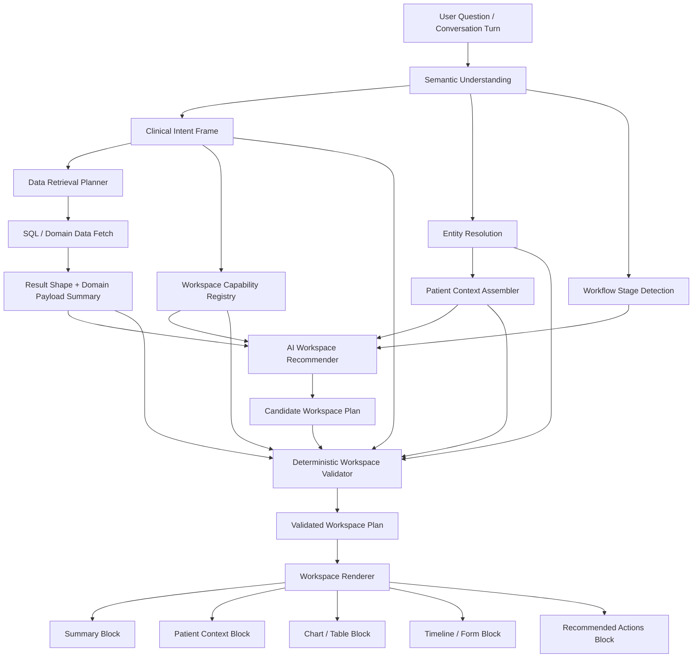
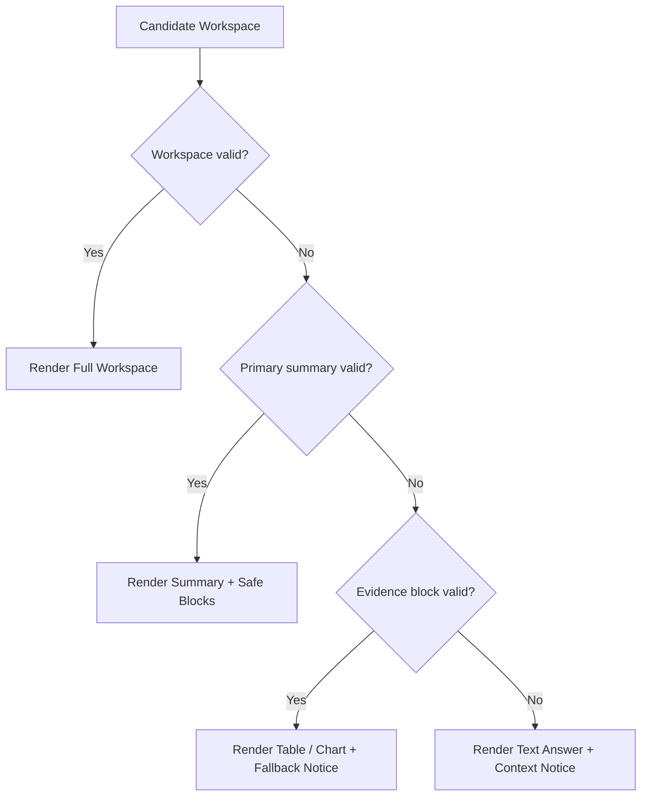

# AI-Native Clinical Workspace Architecture V2

**Status:** Design proposal only  
**Supersedes:** `AI_FIRST_PRESENTATION_ARCHITECTURE.md` as the strategic direction  
**Scope:** AI-native clinician workspace, presentation planning, patient context assembly, workflow guidance  
**Audience:** Product, frontend, backend, semantic-layer, AI orchestration, clinical workflow design

## 1. Executive Summary

The V1 proposal correctly identified that chart-specific artifact planning is too narrow.

But the real product opportunity is larger than choosing the right widget.

The goal is not:

- better chart inference
- more widget types
- a cleaner renderer boundary

The goal is:

- reduce clinician navigation
- reduce documentation burden
- surface the right patient context automatically
- help the clinician decide and act inside the same flow
- make the software feel like an assistant, not a maze

So V2 reframes the architecture from **presentation planning** to **workspace planning**.

The new rule is:

- AI helps assemble the best workspace for the current question, patient, and workflow moment
- the system validates every block against trusted data contracts and access rules
- the UI renders a clinician-facing workspace, not just a list of artifacts
- each block explains why it is shown, where the data came from, and what the user can do next

This keeps the system AI-native without making the product feel hallucinated, fragile, or generic.

## 2. The Product We Are Actually Building

The intended user experience is:

1. A clinician asks a question in natural language
2. The system understands the clinical and workflow context
3. The system assembles the most relevant patient facts, trends, summaries, and actions
4. The clinician sees one coherent workspace tailored to the moment
5. The clinician can inspect, trust, act, and continue the conversation without page-hopping

This means the unit of product design is no longer a chart or a table.

It is a **workspace** centered on:

- patient context
- clinical intent
- workflow stage
- recommended next actions
- trustworthy provenance

## 3. Problem Statement

### Current problems

1. Presentation logic is still artifact-first, not clinician-first.
2. The system can decide between chart and table, but it cannot yet assemble a coherent patient-centric workspace.
3. Presentation intent is under-modeled relative to the broader semantic frame.
4. The renderer can display outputs, but the product does not yet model:
   - why this block is shown now
   - what should come next
   - what action the clinician can take
   - how trust is communicated
5. Domain widgets are treated as future renderers, not as part of an end-to-end workflow system.

### Why this matters

If the product goal is to free clinicians from rigid workflows, then the system must answer:

`Given the user's question, patient context, clinical context, workflow stage, permissions, and live data, what should the clinician see first, what should they be able to do next, and why should they trust it?`

That is the real architecture problem.

## 4. Design Goals

1. **Clinician-centered workspace planning**
   - Compose the UI around the clinician's task, not around page structure.

2. **Patient context as a first-class object**
   - The system should automatically assemble the patient facts most relevant to the current conversation.

3. **Actionability, not just presentation**
   - The system should recommend next actions, not only render information.

4. **Strict trust contracts**
   - Every visible block must carry validated data, provenance, and recency metadata.

5. **Extensible block model**
   - New blocks should be addable without redesigning orchestration.

6. **Compatibility with the existing insight stack**
   - V2 should preserve current chart/table behavior during migration.

7. **Single planning pipeline**
   - Ask, follow-up, cached replay, and future saved workflows should all use the same workspace planner.

## 5. Non-Goals

1. Building every future workflow in one phase
2. Replacing the semantic SQL pipeline immediately
3. Supporting arbitrary unconstrained UI generation
4. Giving AI authority to bypass contracts, permissions, or provenance checks
5. Solving autonomous clinical action execution in this phase

## 6. Core Design Principles

### 6.1 Context first, widgets second

Widgets are leaves. The trunk is the clinician's context.

### 6.2 AI suggests, contracts decide

AI may recommend:

- what belongs in the workspace
- what should be primary
- which alternate blocks are useful
- what action should be suggested next
- what explanation title or summary to show

AI may not bypass:

- supported block registry
- required input contracts
- authorization checks
- provenance requirements
- freshness and recency rules

### 6.3 Explicit request beats inference

If the clinician asks for a chart, timeline, form, or patient summary, that is a high-priority constraint.

### 6.4 Trust is part of the product

Every AI-selected block must answer:

- why am I seeing this?
- where did this come from?
- how fresh is it?
- what was inferred versus directly retrieved?

### 6.5 One workspace, many states

The system should support:

- initial answer
- follow-up refinement
- patient review
- documentation support
- exception and fallback states

without forcing the user into a different page model each time.

## 7. V2 Architecture Overview



## 8. Core Domain Objects

### 8.1 ClinicalIntentFrame

Extend the existing semantic frame instead of creating a parallel intent universe.

It should include:

- analytical intent
- presentation preference
- clinical goal
- workflow stage
- entity focus
- action preference
- explanation depth preference

### 8.2 PatientContextBundle

This is the first missing foundational object.

It represents the trusted patient-specific context available for the current turn.

```ts
interface PatientContextBundle {
  patientRef: string;
  summary: {
    displayName: string;
    age?: number;
    sex?: string;
    primaryFlags: string[];
  };
  activeProblems: Array<{ label: string; source: string; observedAt?: string }>;
  recentAssessments: Array<{ id: string; date: string; status?: string }>;
  woundHighlights: Array<{ woundRef: string; label: string; status?: string }>;
  alerts: Array<{ label: string; severity: "low" | "medium" | "high" }>;
  provenance: Array<{
    section: string;
    sourceType: "sql" | "domain_service" | "derived";
    sourceRef?: string;
    retrievedAt: string;
  }>;
}
```

### 8.3 WorkspacePlan

This is the main product object.

```ts
interface WorkspacePlan {
  mode: "answer" | "review" | "compare" | "document" | "follow_up";
  primaryBlockId: string;
  blocks: WorkspaceBlock[];
  actions: WorkspaceAction[];
  explanation: {
    headline: string;
    rationale: string;
  };
  source: {
    explicitRequestSatisfied: boolean;
    aiRecommended: boolean;
    fallbackApplied: boolean;
  };
}
```

### 8.4 WorkspaceBlock

```ts
type WorkspaceBlock =
  | SummaryBlock
  | PatientContextBlock
  | ChartBlock
  | TableBlock
  | TimelineBlock
  | AssessmentFormBlock
  | PatientCardBlock
  | ExplanationBlock
  | AlertBlock
  | ActionPanelBlock;
```

Each block must include:

- contract-validated payload
- provenance metadata
- confidence or certainty markers when applicable
- freshness metadata
- reason for inclusion

### 8.5 WorkspaceAction

This is the second missing foundational object.

```ts
interface WorkspaceAction {
  kind:
    | "ask_follow_up"
    | "open_assessment"
    | "show_timeline"
    | "compare_periods"
    | "explain_change"
    | "export"
    | "save_view";
  label: string;
  reason: string;
  enabled: boolean;
  requires?: string[];
}
```

## 9. Planner Stages

### Stage 1: Understand the request

Resolve:

- analytical intent
- explicit presentation request
- clinical goal
- workflow stage
- resolved entities

### Stage 2: Assemble context

Build the `PatientContextBundle` and other relevant domain context.

This is not optional for clinician delight. The system should not force the user to repeatedly ask for obvious surrounding facts.

### Stage 3: Retrieve data

Support both:

1. **SQL result path**
   - analytics rows and columns

2. **Domain object path**
   - patient profile data
   - assessment form payloads
   - assessment history
   - workflow metadata

### Stage 4: AI workspace recommendation

The recommender receives:

- user question
- clinical intent frame
- patient context bundle
- result summary
- workflow stage
- supported block registry

It returns:

- candidate workspace mode
- ordered blocks
- primary block
- alternate blocks
- suggested actions

### Stage 5: Deterministic validation

Validation must answer:

1. Is each block supported?
2. Are required entities present?
3. Is the user authorized to see it?
4. Is the payload contract satisfied?
5. Is provenance available?
6. Is freshness acceptable?
7. If invalid, what is the next valid block or fallback?

### Stage 6: Workspace rendering

Render the validated workspace plan inline in the conversation.

The renderer should not infer meaning. It should render trusted blocks.

## 10. V2 Intent Model

Instead of replacing the current semantic frame, extend it.

```ts
interface ClinicalIntentFrame {
  semantic: SemanticQueryFrame;
  presentation: {
    explicitMode:
      | "chart"
      | "table"
      | "summary"
      | "patient_card"
      | "assessment_form"
      | "assessment_timeline"
      | null;
    inferredModes: Array<{ mode: string; confidence: number; reason: string }>;
  };
  workflow: {
    stage:
      | "question_answering"
      | "patient_review"
      | "trend_review"
      | "assessment_review"
      | "documentation_support"
      | "follow_up";
    goal:
      | "inspect"
      | "compare"
      | "decide"
      | "document"
      | "handoff";
  };
}
```

This keeps one source of truth.

## 11. Trust Envelope

Every block shown to a clinician should carry a trust envelope.

```ts
interface TrustEnvelope {
  provenance: Array<{
    sourceType: "sql" | "domain_service" | "derived";
    sourceLabel: string;
    retrievedAt: string;
  }>;
  freshness: {
    retrievedAt: string;
    stale: boolean;
    reason?: string;
  };
  aiContribution: {
    usedForSelection: boolean;
    usedForSummarization: boolean;
    usedForMapping: boolean;
  };
}
```

The UI should expose this simply:

- why this is shown
- how recent it is
- where it came from

## 12. User Experience Model

The default workspace should be structured like this:

1. **What matters now**
   - direct answer or summary

2. **Patient context**
   - the patient facts needed to interpret the answer

3. **Evidence view**
   - chart, table, timeline, or form

4. **Recommended next actions**
   - smart follow-ups and workflow shortcuts

This creates the feeling that the software is following the clinician, not the other way around.

## 13. State Machine

```text
QUESTION ASKED
  -> CONTEXT RESOLVING
  -> DATA FETCHING
  -> WORKSPACE PLANNING
  -> VALIDATING
  -> RENDERING

RENDERING
  -> READY
  -> PARTIAL_READY
  -> FALLBACK_READY
  -> ERROR

READY
  -> FOLLOW_UP_ASKED
  -> ACTION_SELECTED
  -> CONTEXT_REFRESHED
```

Invalid transitions:

- render unvalidated blocks
- show patient context without authorization
- suggest actions with missing prerequisites

## 14. Failure States and Fallbacks

### Failure types

1. AI recommends unsupported block
2. Required patient or assessment entity is unresolved
3. Context bundle is partially unavailable
4. A block is valid structurally but stale clinically
5. SQL succeeds but domain payload fetch fails
6. The primary block is empty in practice
7. An action is suggested but its prerequisites are missing

### Fallback policy

1. Preserve the answer if possible
2. Degrade blocks, not the whole workspace
3. Prefer summary + table over broken rich UI
4. Explain why richer context was omitted
5. Never silently imply trust when provenance is missing



## 15. Migration Strategy

### Phase 1: Keep the current chart hardening plan

Do not skip this.

- preserve current chart and table compatibility
- unify route parity
- validate chart artifacts before render

### Phase 2: Introduce shared planning primitives

- extend the semantic frame into a clinical intent frame
- add block registry
- add trust envelope
- add workspace plan type while preserving current artifact output

### Phase 3: Introduce patient context assembly

- build `PatientContextBundle`
- support patient summary and patient card blocks
- render summary + patient context + evidence together

### Phase 4: Introduce action recommendations

- add recommended next actions
- support follow-up shortcuts
- capture override behavior

### Phase 5: Generalize beyond insight presentation

- assessment review
- timeline review
- documentation support
- saved workflow execution

## 16. Compatibility Strategy

V2 should not break the current product during rollout.

Rules:

- existing `InsightArtifact` consumers remain supported during migration
- the first `WorkspacePlan` output may be compiled down into artifact-compatible blocks
- chart/table behavior remains default-compatible
- new clinician-workspace behavior should be feature-flagged

Suggested flags:

- `workspacePlanningV2`
- `patientContextBundle`
- `workspaceActionRecommendations`
- `patientCardBlock`

## 17. Implementation Sequence

1. Ship Phase 1 chart hardening unchanged
2. Extend the semantic frame instead of creating a second intent model
3. Introduce `WorkspacePlan` and `WorkspaceBlock`
4. Add `TrustEnvelope`
5. Build `PatientContextBundle`
6. Add `PatientContextBlock` and `PatientCardBlock`
7. Add `WorkspaceAction`
8. Move the conversation UI from artifact-list rendering toward workspace rendering

## 18. Why V2 Is Better Than V1

V1 says:

- choose the best widget
- validate it
- render it safely

V2 says:

- understand the clinician's goal
- assemble the surrounding patient context
- choose the right blocks and actions
- validate everything
- present one coherent workspace

That is much closer to the intended product.

## 19. Three Questions

### Is this a real problem?

Yes. Clinician pain is not just bad charting. It is fragmented context, excessive navigation, and documentation-heavy workflow.

### Is there a simpler solution?

Yes. The simpler solution is not more widget heuristics. The simpler solution is one planner that composes a trusted workspace around the clinician's task.

### Will this break anything existing?

It should not. The migration path preserves existing chart/table output first, then layers in workspace planning behind feature flags.

## 20. Recommendation

Move from:

- `ArtifactPlannerService`
- chart/table-first artifact thinking
- isolated presentation inference

to:

- `WorkspacePlannerService`
- `PatientContextBundle`
- `WorkspacePlan`
- `WorkspaceAction`
- trust-envelope-driven rendering
- clinician-centered workspace composition

This is the right foundation if the product ambition is to make clinicians feel that the software is working around them instead of forcing them through rigid screens and workflows.
